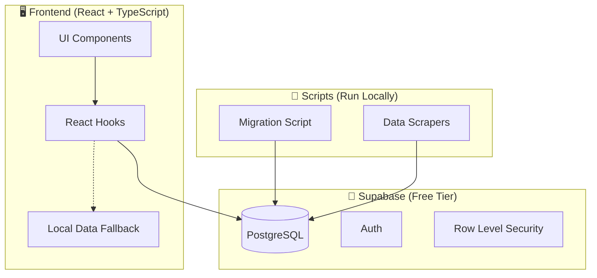
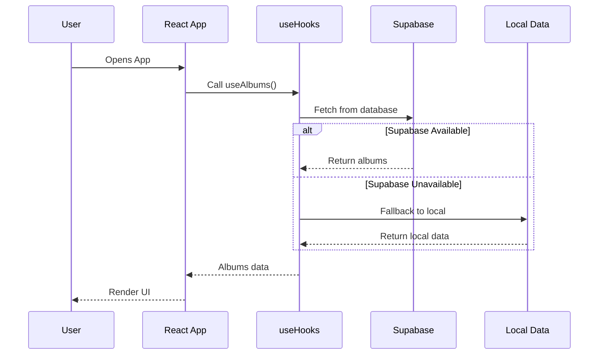
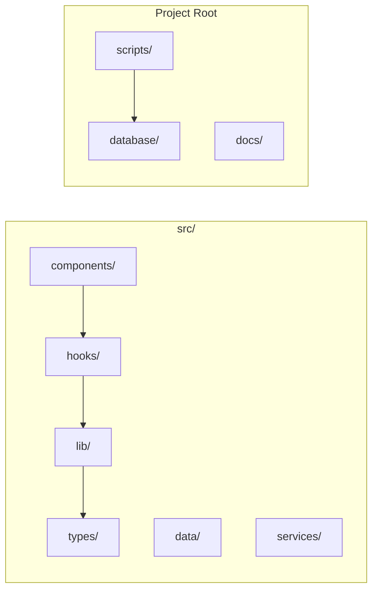
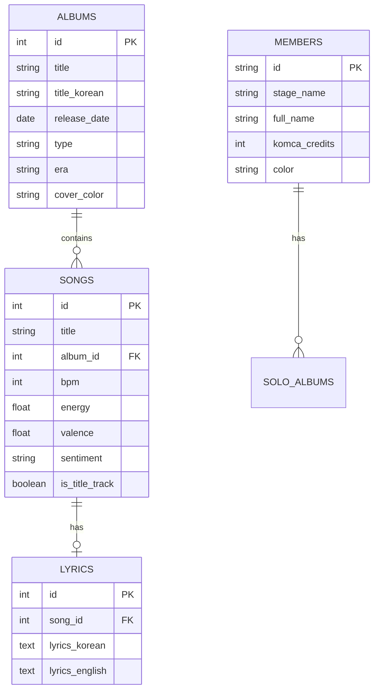
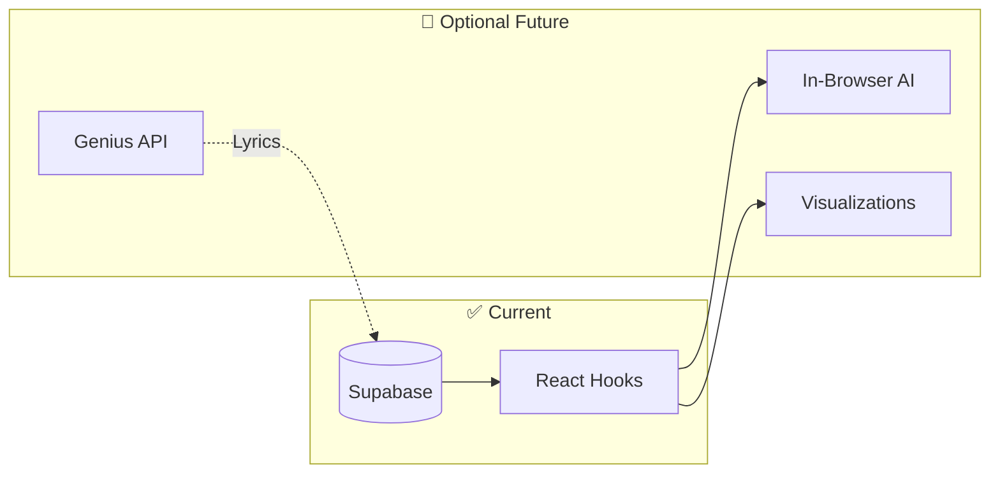

# 🏗️ BTS Universe - System Architecture

> Simple overview of the project architecture with Supabase integration

## High-Level Architecture

---

## Data Flow

---

## Project Structure

---

## Database Schema

---

## Technology Stack

| Layer | Technology | Purpose |
|-------|------------|---------|
| **Frontend** | React 19 + TypeScript | UI & Logic |
| **Styling** | Tailwind CSS 4 | Styling |
| **Build** | Vite 7 | Dev server & bundling |
| **Database** | Supabase (PostgreSQL) | Data storage |
| **Scripts** | tsx + Node.js | Migrations & scrapers |

---

## Key Files

| File | Purpose |
|------|---------|
| `src/lib/supabase.ts` | Database client configuration |
| `src/hooks/useAlbums.ts` | Albums data hook |
| `src/hooks/useSongs.ts` | Songs data hook |
| `src/hooks/useMembers.ts` | Members data hook |
| `src/types/database.ts` | TypeScript types for DB |
| `database/schema.sql` | PostgreSQL schema |
| `scripts/migrate-to-supabase.ts` | Data migration script |

---

## Future Additions (Optional)

---

💜 *"I purple you"* - Architecture designed with love for BTS & ARMY
